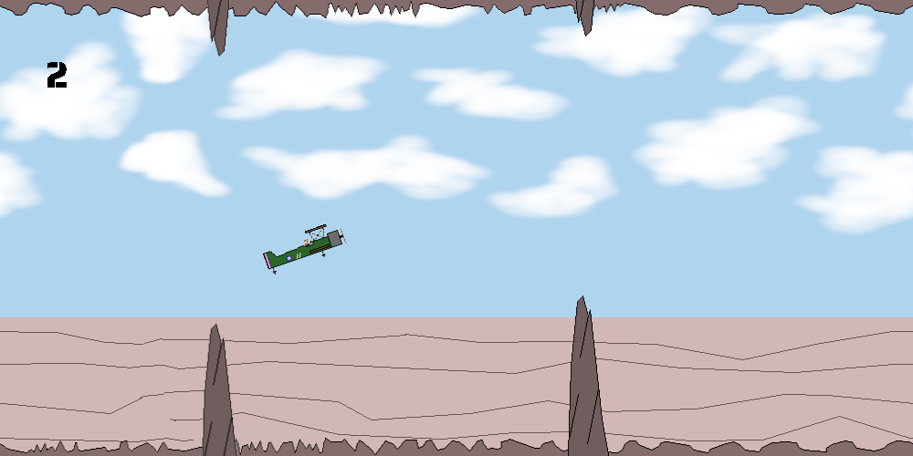

# Biplane

Biplane is a 2D flying game, built using LÖVE.

Check it out [here](https://trbromley.github.io/biplane/)!

## How to run

- Clone this repository
- Install LÖVE using the instructions [here](https://love2d.org/wiki/Getting_Started)
- Install Lua using the instructions [here](https://www.lua.org/download.html)
- Change directory into the repository and run `love .`
